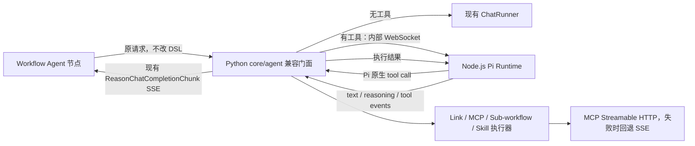

# Workflow Pi Agent Runtime 设计

日期：2026-08-03

## 目标

把开源版 Astron Agent 中 Workflow ReAct 节点的手写 `CotRunner` 运行时替换为 `earendil-works/pi` 的原生 agent loop。所有带工具的 Agent 节点都使用 Pi；无工具的普通对话继续走现有 `ChatRunner`。现有前端、工作流 DSL、公开 SSE 接口和输出结构保持不变。

本分支完成第一阶段：Python 兼容门面加独立 Node.js Pi Runtime。第二阶段仅给出迁移边界，后续再把公开 Agent 服务和工具适配器整体迁到 TypeScript。

## 已确认的行为

- 不修改 `console/frontend`。
- `maxLoopCount` 继续被工作流 DSL 和 Agent API 接受，避免旧工作流无法加载；它不再参与带工具 Agent 的停止决策。
- 不保留旧 `CotRunner`、`CotProcessRunner`、Thought/Action/Observation 提示词、文本解析器、scratchpad 或循环次数溢出的生产回退路径。
- Pi Runtime 不可用时返回明确错误，不静默回退到旧逻辑。
- Pi 自己根据原生 tool call 和最终回答结束循环。服务端只增加总时长、取消传播和重复调用熔断三类兜底。
- 提供 Pi 本地 `wait(seconds)` 工具。模型决定等待时，运行时执行真正、可取消的等待；不会另外实现自动轮询状态机。
- MCP 同时支持 Streamable HTTP 和旧 SSE。当前开源主线已经实现 `AUTO -> Streamable HTTP -> SSE fallback`，本分支复用该实现并验证 Pi 工具桥能调用它。

## 第一阶段架构

Python 仍负责公开 `/agent/v1/custom/chat/completions`、鉴权、知识检索、插件发现、工具实际执行、节点 trace 和公开 SSE 序列化。Node.js 只负责 Pi 的模型会话、原生 agent loop、工具调度和运行时安全策略。

Python 与 Pi Runtime 使用单次运行独占的 WebSocket 会话，原因是工具调用天然是双向的：Pi 一边流式产出模型事件，一边等待 Python 执行现有插件后回传结果。这样不需要跨 worker 的内存注册表、回调 URL 或负载均衡粘性，也不会把 Python 插件实现复制到 TypeScript。

## 内部协议

连接：`ws://pi-agent-runtime:8090/internal/v1/runs`，使用共享 Bearer secret；服务另提供只读 `/healthz`。

Python 建立连接后发送一个 `start` 消息：

- `runId` 和 trace 元数据；
- 模型的 `id`、`provider`、规范化 `baseUrl`、临时 `apiKey`；
- 纯业务 system prompt、历史消息和当前用户问题；
- 工具的唯一运行时名称、展示名称、描述、JSON Schema 和类型。

Pi Runtime 向 Python发送：

- `content_delta` / `reasoning_delta`：映射到现有公开 chunk；
- `tool_call`：包含 `callId`、运行时工具名和通过 Pi/TypeBox 校验后的参数；
- `tool_progress`：可选的长任务进度；
- `tool_completed`：供现有 trace 和 tool-call chunk 使用；
- `usage`、`error`、`done`。

Python 收到 `tool_call` 后调用本次请求中已构建的插件对象，并用相同 `callId` 回复 `tool_result`。普通插件返回一次结果；子工作流的流式内容在收集为 Pi tool result 的同时继续映射到现有 SSE，以保持当前用户可见行为。

客户端断开、请求取消或总时长到期时，Python 关闭 WebSocket；Pi Runtime 通过 `AbortController` 中止模型流、`wait` 和待执行工具。

## Pi 原生运行循环

Node 服务直接消费 `@earendil-works/pi-agent-core` 的 `agentLoop()` 事件流，不在其外层实现推理循环。工具使用 Pi `AgentTool`，参数使用 JSON Schema/TypeBox 校验，工具执行使用 Pi 的 `execute()` 回调。模型接入使用 `@earendil-works/pi-ai` 的 `createProvider()` 以及对应官方 provider API：

- OpenAI 兼容接口：`openAICompletionsApi()`；
- Anthropic：`anthropicMessagesApi()`；
- Google：`googleGenerativeAIApi()`。

运行时配置为顺序工具执行，匹配现有插件 trace 与子工作流流式语义；循环何时继续或结束仍完全由 Pi 和模型的原生 tool call / stop reason 决定。

## 工具契约

`BasePlugin` 增加显式 `parameters` JSON Schema。Link、MCP、Sub-workflow 和 Skill factory 在创建插件时同时填写该字段；`schema_template` 仅暂时保留给旧数据结构和日志，不再作为模型提示词或解析来源。

工具名经确定性规范化后发送给 Pi，并维护运行时名到 Python 插件对象的单次会话映射。发生冲突时使用稳定后缀，公开 trace 仍显示原插件名，避免错误调用同名工具。

`wait` 是 Pi Runtime 的本地工具：

- 参数：`seconds`，允许小数；
- 默认最大单次等待 120 秒，可由后端环境变量调整；
- 使用 AbortSignal，可被客户端取消和总时长截止中断；
- 结果明确告诉模型实际等待时长。

系统提示只描述可用能力和业务 instruction，不强制模型轮询。用户说“30 秒后再查”时，模型可以调用 `wait({seconds: 30})`；是否再次查询仍由 Pi 自己决定。

## 安全与终止

- 总运行时长默认 25 分钟，低于现有上游请求的 30 分钟边界，并允许后端环境变量调整。
- 相同工具和相同参数连续调用达到默认 8 次时，Pi `beforeToolCall` 阻止下一次执行并把原因返回模型。调用 `wait` 或不同参数会打断连续计数，因此“查询 -> 等待 -> 查询”不会误触发。
- `maxLoopCount` 不传给 Pi，避免重新引入固定 100 次循环上限。
- 所有安全停止都产生结构化内部错误和可诊断日志；不会启动旧 Cot 回退。

## 兼容层与错误处理

公开请求仍使用 `CustomCompletionInputs`，包括 `max_loop_count`。公开响应继续使用 `ReasonChatCompletionChunk`，因此 Workflow 节点、Console 后端和前端都不需要修改。

Pi 连接失败、鉴权失败、协议消息非法、工具不存在、插件执行失败和总时长到期分别记录 run id、工具名和阶段。API key 不写入日志。插件错误作为 Pi tool result 返回，让模型有机会解释或改用其他工具；运行时/协议错误终止本次 Agent 请求。

## 部署

新增独立、非公开的 `core/pi-agent` 镜像和服务：

- Node.js 版本不低于 22.19；
- 只暴露容器网络端口 8090；
- Python Agent 配置 `PI_AGENT_RUNTIME_URL` 和 `PI_AGENT_INTERNAL_SECRET`；
- 两个服务使用同一 secret，健康检查通过 `/healthz`；
- Docker Compose 与 Helm 都增加服务、环境变量和依赖关系。

不在 Nginx 或公网 Ingress 暴露 Pi Runtime。

## 测试策略

测试按行为边界分层：

1. Node 单元测试：模型配置映射、事件映射、真正等待与取消、重复调用熔断、工具桥关联、认证和非法协议。
2. Python 单元测试：插件 JSON Schema、Pi 请求不包含 `max_loop_count`、工具执行/流式子工作流收集、Pi 事件到现有 chunk 的映射、Pi 不可用时不回退 Cot。
3. 跨服务契约测试：使用假的 Pi 模型事件流，让 Pi 发起工具调用，Python 回传结果并产出既有 SSE 结构。
4. MCP 回归：运行开源主线已有 Streamable HTTP、AUTO fallback 和 SSE 测试，并增加经 Pi 工具桥执行 MCP 插件的用例。
5. 部署验证：Node typecheck/build、Python 目标测试、Compose 配置渲染和 Helm template。

所有生产改动先写能证明目标行为的失败测试，再写最小实现。

## 第二阶段迁移边界

第二阶段把公开 `/agent/v1/custom/chat/completions`、知识/工具适配和 trace 序列化迁入 TypeScript，Workflow 节点最终直接调用 TypeScript Agent 服务。迁移时保留本阶段定义的公开 SSE 契约和工具 JSON Schema；把 WebSocket 工具桥替换为进程内 TypeScript adapter 或独立工具服务。Python Agent 服务只在全部契约测试和灰度验证完成后移除。

本分支不提前实现第二阶段，也不为第二阶段修改前端。
